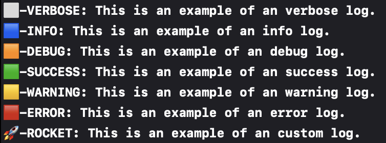

# LogKit

<!-- # Badges -->

[](https://github.com/SNQ-2001/LogKit/issues)
[](https://github.com/SNQ-2001/LogKit/network/members)
[](https://github.com/SNQ-2001/LogKit/stargazers)
[](https://github.com/SNQ-2001/LogKit/)
[](https://github.com/SNQ-2001/LogKit/)

# How to use
```swift
import LogKit

print(.verbose, "This is an example of an verbose log.")
print(.info, "This is an example of an info log.")
print(.debug, "This is an example of an debug log.")
print(.success, "This is an example of an success log.")
print(.warning, "This is an example of an warning log.")
print(.error, "This is an example of an error log.")
print(.custom("🚀-ROCKET"), "This is an example of an custom log.")
```



# Contributors

- [SNQ-2001](https://github.com/SNQ-2001)

<!-- CREATED_BY_LEADYOU_README_GENERATOR -->
